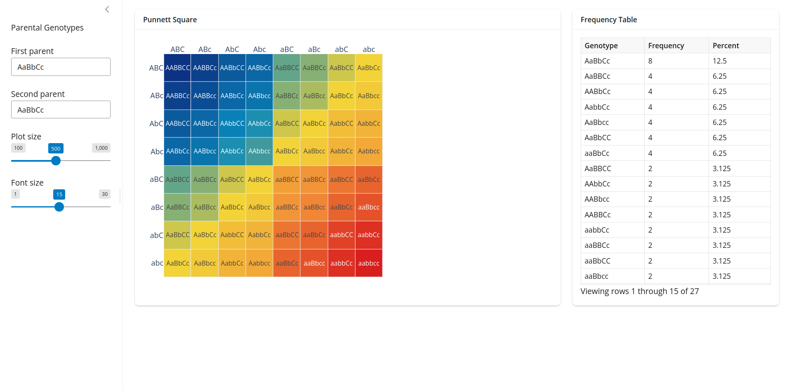

## How to Run the App

To run the app:

```sh
$ git clone https://github.com/andrkoles/punnett_square_app.git

$ cd punnett_square_app

$ python3 -m venv .venv

$ source .venv/bin/activate

(.venv) $ pip install -r requirements.txt

(.venv) $ shiny run app.py
```

Here is a screenshot of the app:


